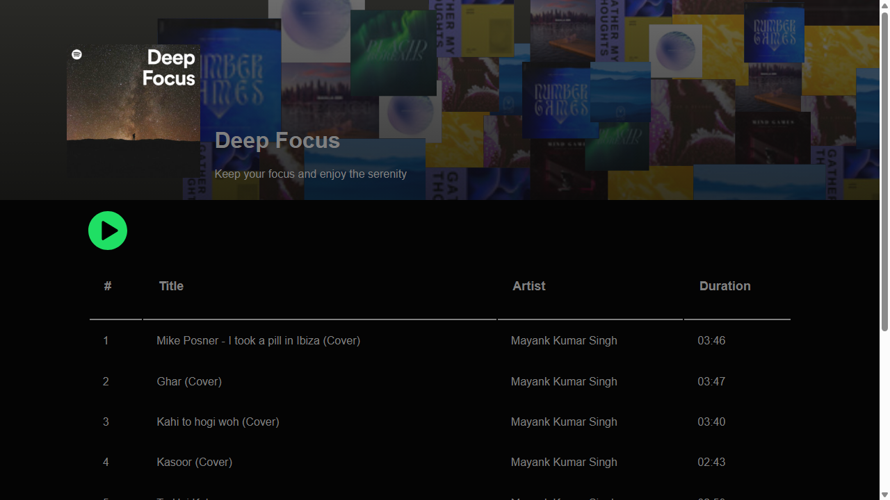

<div align="center">

# 🎵 Spotify Clone

**A Spotify-inspired music streaming web interface built with HTML, CSS and JavaScript**

[](https://mayankksingh5.github.io/Spotify_Clone/)




</div>

## ✨ Features

- 🎧 Playlist with play/pause controls using the HTML5 `<audio>` element
- 🖼️ The banner artwork, title and artist update to match the playing track
- ⏯️ Clicking the playing track again pauses it and restores the default banner
- 🎤 Tracks credited as covers by Mayank Kumar Singh

## 🛠️ Tech stack

| Part | Technology |
| --- | --- |
| Structure | HTML5 |
| Styling | CSS3 |
| Interactivity | Vanilla JavaScript (DOM, HTML5 Audio) |
| Hosting | GitHub Pages |

## 🚀 Run locally

```bash
git clone https://github.com/mayankksingh5/Spotify_Clone.git
cd Spotify_Clone
# open index.html in your browser
```

## 📁 Project structure

```
Spotify_Clone/
├── index.html   # layout and playlist
├── style.css    # styling
├── script.js    # playback and banner updates
├── images/      # artwork and icons
└── music/       # audio tracks
```

## 👤 Author

**Mayank Kumar Singh** · Associate DevOps Engineer

[](https://mayank-portfolio.mayankksingh5.workers.dev)
[](https://github.com/mayankksingh5)
[](https://www.linkedin.com/in/mayank-singh-298718204)

<sub>⭐ If you found this project useful, consider giving it a star.</sub>
